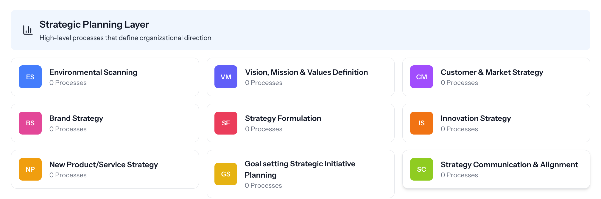
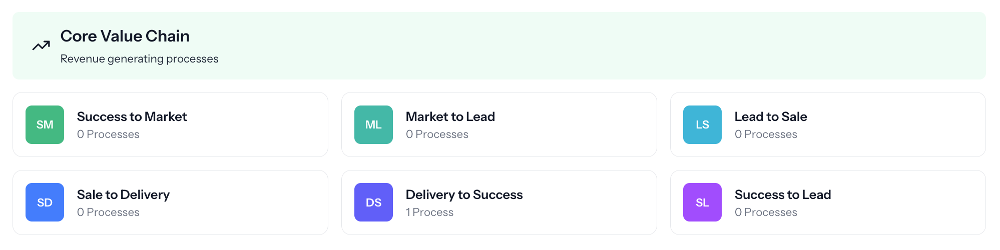
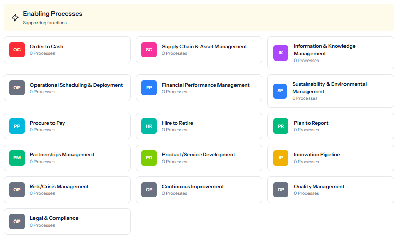

# Exercise 2.2: Explore the Three Layers of Business Processes

> Curriculum › Section 3: Live Session 2: The Invisible Structure of Business › Lesson 4

[Open on Circle](https://community.empowerlabs.ai/c/curriculum-f7e760/sections/887007/lessons/3372391)

## Files

- [img01-Screenshot-2025-05-29-at-11.56.43_AM.png](./assets/img01-Screenshot-2025-05-29-at-11.56.43_AM.png) (141 KB)
- [img02-Screenshot-2025-05-29-at-11.56.58_AM.png](./assets/img02-Screenshot-2025-05-29-at-11.56.58_AM.png) (79 KB)
- [img03-image-24.png](./assets/img03-image-24.png) (61 KB)

## Content

We've seen how the basic customer journey transforms from a linear path into a powerful virtuous cycle. But this cycle doesn't operate in isolation—it's part of a larger, integrated business system.

Successful businesses don't just optimize the customer journey; they build a complete ecosystem where every function works together to support growth, innovation, and sustainability.

Let's expand our view to see the 3 layers of a business process system:

---

## **1. Strategic Planning Layer**

*Purpose: Setting direction and allocating resources*

_img01-Screenshot-2025-05-29-at-11.56.43_AM.png_

This top level guides everything below it, ensuring all business activities align with your long-term vision and goals. It includes:

- **Strategic Planning**: Defining your business vision, mission, and long-term objectives to guide all other processes

---

## **2. The Customer Lifecycle**

*Purpose: Directly generating revenue and serving customers*

_img02-Screenshot-2025-05-29-at-11.56.58_AM.png_

This is the layer we covered in the previous lesson.

---

## **3. Enabling Processes**

*Purpose: Supporting and strengthening the core business*

_img03-image-24.png_

These foundational processes may not directly generate revenue, but they're essential for operational excellence and long-term sustainability. Including:

- **Order to Cash**: Managing the financial flow from customer orders to revenue collection
- **Supply Chain & Asset Management**: Sourcing, storing, and maintaining the physical resources needed to deliver value
- **Information Technology & Knowledge Management**: IT operations, security, system maintenance, and organizing data and insights to support decision-making across the business
- **Operational Scheduling & Deployment**: Scheduling and deploying operational resources including workforce, equipment, machinery, vehicles, and tools to ensure efficient service delivery and project execution
- **Financial Performance Management**: Tracking, analyzing, and optimizing financial outcomes
- **Sustainability & Environmental Management**: Minimizing negative impacts and creating positive change
- **Vendor/Supplier Management:** Managing vendor relationships and expenditures
- **Hire to Retire**: Building and supporting your team through recruitment, development, and offboarding
- **Plan to Report**: Setting goals and measuring progress through KPIs and reporting
- **Partnerships Management**: Developing and maintaining strategic relationships with other organizations
- **Risk/Crisis Management**: Identifying, mitigating, and responding to potential threats
- **Continuous Improvement**: Systematically enhancing processes across all areas of the business
- **Quality Management**: Establishing standards, implementing control systems, and continuously monitoring to ensure consistent delivery of products/services that meet or exceed customer expectations across all business functions
- **Legal & Compliance**: Managing regulatory requirements, contract administration, intellectual property protection, and ensuring adherence to applicable laws and industry standards across all business operations

---

## **The Integrated System**

What makes truly exceptional businesses stand out is how these layers work together:

1. **Vertical Integration**: Information flows both ways between the layers. Strategic plans guide operations, while operational results inform strategy.
2. **Horizontal Integration**: Processes within each layer coordinate with each other. For example, Resource Planning aligns with Financial Modeling in the Strategic layer.
3. **Process Maturity**: As businesses evolve, their processes become more systematic, documented, measured, and optimized.

By viewing your business as this integrated system of processes with multiple inputs and outputs rather than isolated departments or functions, you can identify bottlenecks, opportunities, and ways to create more value with fewer resources, including with AI.

Most importantly, this perspective helps ensure that every activity in your business ultimately contributes to serving customers and achieving your strategic goals.

> **Instructor note**: We’ll be tackling each of the three layers of your business in turn, and the screenshots above correspond to the Processes app we’ll be using to store, organize, and visualize the processes that run your business.
