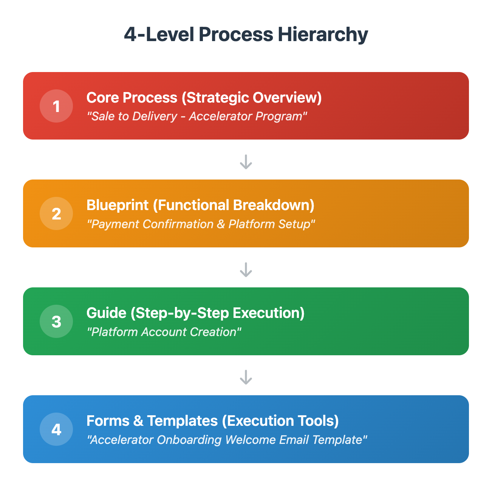

# Exercise 3.2: Discover the 4-Level Documentation Framework

> Curriculum › Section 4: Live Session 3: The EMPOWER Operating System › Lesson 3

[Open on Circle](https://community.empowerlabs.ai/c/curriculum-f7e760/sections/892608/lessons/3381155)

## Files

- [img01-Screenshot-2025-06-03-at-12.22.28_PM.png](./assets/img01-Screenshot-2025-06-03-at-12.22.28_PM.png) (574 KB)

## Content

## **The Documentation Problem Most Businesses Face**

Most companies either create hundreds of scattered micro-processes that fragment the big picture or build massive 50-page documents that overwhelm people trying to get work done. Both approaches fail because they don't match how people actually think and work.

The solution is a systematic hierarchy that separates *strategic thinking* from *tactical execution*, allowing you to scale operations without losing quality or clarity.

---

## **The 4-Level Hierarchy: From Strategy to Execution**

_img01-Screenshot-2025-06-03-at-12.22.28_PM.png_

### **Level 1: Core Process (i.e. Strategic Overview)**

**Owner:** Directors or Executives (Accountable for the entire function)  
**Audience:** Leadership team, cross-functional stakeholders, process integrators

Core Processes are the highest-level view of how major business functions operate. They show the complete flow of a critical business process from start to finish, including all stakeholders and strategic considerations.

**What Core Processes Include:**

- Complete end-to-end process flow with visual diagram
- Strategic objectives and success criteria
- Cross-functional dependencies and handoff points
- Key performance indicators and business impact metrics
- Integration with other core business processes
- RACI matrix showing all stakeholders involved

**Examples:**

- "Sale to Delivery - Product 1"

- "Market to Lead - Product 1"
- "Delivery to Success - Product 1"

**In other words:** Level 1 is all about strategic planning, process optimization, onboarding senior team members, and understanding how one person’s work fits into the bigger business picture.

### **Level 2: Blueprint (i.e. Functional Breakdown)**

**Owner:** Managers or Directors (Accountable for specific functional area)  
**Audience:** Department managers, team leads, project coordinators

Blueprints break down Core Processes into manageable functional chunks. They show how a specific area of responsibility works within the larger process, focusing on coordination and quality standards.

**What Blueprints Include:**

- Detailed workflow for one functional area
- Quality gates and success checkpoints
- Resource requirements and capacity planning
- Handoff procedures to other functions
- Timeline and service level agreements
- Common issues and escalation procedures

**Examples:**

- "Payment Confirmation & Platform Setup" (within Sale to Delivery)
- "Inbound Marketing Blueprint" (within Market to Lead)
- "Weekly Progress Reviews" (within Delivery to Success)

**In other words:** Level 2 is about managing team capacity, coordinating with other departments, training managers, and ensuring consistent quality across similar activities.

### **Level 3: Guide (i.e. Step-by-Step Execution)**

**Owner:** Managers or Senior Individual Contributors (Person who most often executes this activity)  
**Audience:** Individual contributors, team members doing the actual work

Guides provide detailed, step-by-step instructions for specific activities within a Blueprint. They're designed for the person actually doing the work, with everything they need to execute consistently and efficiently.

**What Guides Include:**

- When and how to start the activity
- Step-by-step instructions with time estimates
- Required tools, access, and resources
- Quality checkpoints and verification steps
- Common problems and how to solve them
- What to do when finished (documentation, handoffs)

**Examples:**

- "Platform Account Creation" (within Payment Confirmation & Platform Setup)
- "Blog Content Creation Guide" (within Inbound Marketing Blueprint)
- "Student Progress Assessment" (within Weekly Progress Reviews)

**In other words:** Level 3 is about daily task execution, training new team members, ensuring consistency across team members, and maintaining quality standards at the frontline.

### **Level 4: Forms & Templates (i.e. Execution Tools)**

**Owner:** Individual Contributor (Person who most often uses this tool)  
**Audience:** Anyone executing the specific task

Forms and Templates are the actual tools, scripts, calculators, email templates, and documents used to complete the work. These are what people open, fill out, customize, and send.

**What Forms & Templates Include:**

- Ready-to-use templates with placeholders
- Pre-written scripts or email copy
- Calculators or assessment tools
- Checklists and verification forms
- Standard documents and agreements

**Examples:**

- "Accelerator Onboarding Welcome Email Template"
- "SEO Blog Post Checklist"
- "Student Progress Assessment Form"
- "Payment Confirmation Email Script"

**In other words:** Level 4 includes executing specific tasks, ensuring consistent communication, maintaining brand standards, and reducing time spent creating documents from scratch.

---

## **How the Levels Work Together**

1. **Strategic Context Flows Down:** Leadership uses Core Processes to understand business impact. Managers use Blueprints to coordinate their teams. Individual contributors use Guides to execute consistently.
2. **Quality Flows Up:** Templates ensure consistent output. Guides ensure consistent process. Blueprints ensure consistent coordination. Core Processes ensure consistent business results.
3. **Efficiency Through Focus:** Each level serves its specific audience without overwhelming them with unnecessary detail or leaving them without sufficient context.

---

## **Implementation in Your Business**

### **Step #1: Start with What Matters Most**

Begin by identifying your most critical customer-facing processes. These typically include:

- How leads become customers (Lead to Sale)
- How customers get onboarded (Sale to Delivery)
- How you deliver your core service (Delivery to Success)

### **Step #2: Build from Level 1 Down**

1. **Map the Core Process:** Understand the complete flow and all stakeholders
2. **Identify Key Blueprints:** Break down into manageable functional areas
3. **Create Essential Guides:** Document the most critical execution steps
4. **Build Supporting Templates:** Create tools that ensure quality and efficiency

### **Step #3: Use AI to Accelerate Development**

With your Master Prompt and business context, AI can help you:

- Generate complete process flows from high-level descriptions
- Create detailed guides from blueprint overviews
- Build templates and forms based on guide requirements
- Identify gaps and improvement opportunities across all levels

---

## **Why This System Creates Competitive Advantage**

**For Remote Teams:** Everyone has both context (why this matters) and clarity (exactly how to do it), eliminating the confusion that kills remote productivity.

**For Scaling Operations:** You can train new team members faster and maintain quality as you grow, without requiring constant management oversight.

**For Customer Experience:** Consistent processes across all levels ensure every customer receives the same high-quality experience regardless of who serves them.

**For Strategic Agility:** When you need to change how something works, you can see the full impact across all levels and make coordinated updates rather than hoping nothing breaks.
