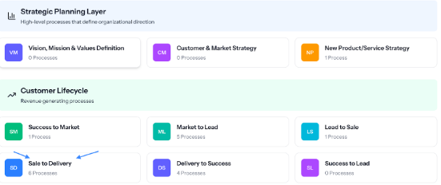
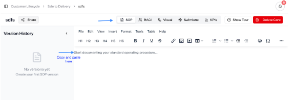
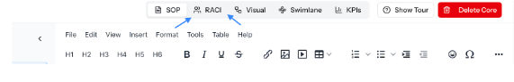
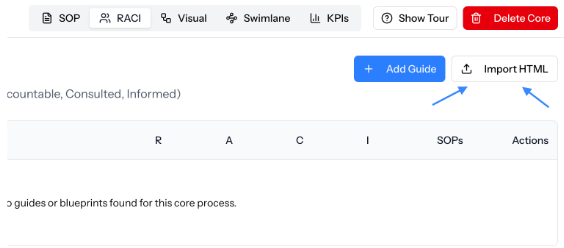

# Exercise 3.6:  Register Your Organization

> Curriculum › Section 4: Live Session 3: The EMPOWER Operating System › Lesson 9

[Open on Circle](https://community.empowerlabs.ai/c/curriculum-f7e760/sections/892608/lessons/3381402)

## Files

- [img01-image.png](./assets/img01-image.png) (55 KB)
- [img02-image.png](./assets/img02-image.png) (36 KB)
- [img03-image.png](./assets/img03-image.png) (25 KB)
- [img04-image.png](./assets/img04-image.png) (16 KB)
- [img05-image.png](./assets/img05-image.png) (26 KB)
- [img06-image.png](./assets/img06-image.png) (79 KB)

## Content

**Purpose:** Stage 3 allows you to:

1. Version control your master prompt and share multiple versions with your team
2. Store and version control your process and share them with your team
3. Take batch action on your processes using your master prompt

**Instructions: **

1. Navigate to [https://hq.stage3.app/register](https://hq.stage3.app/register) to register your owner account. This account will have full administrative rights over the entire organization.    
  
After completing registration, you'll be prompted to enter your organization's name. Once submitted, you'll be redirected to your organization's dashboard and can begin using the system immediately.  
  
Don’t worry about adding your master prompt or adding team members yet, we’ll do that in a later session.  For now, we will just be adding the core process.
2. Navigate to Business Processes on the left
  
  _img01-image.png_
3. Click Sale to Delivery
  
  _img02-image.png_

1. Click New Core Process in the top right.  Name your process.  Sale to Delivery - Company Name - Product/Service Name.   
  
Under Description, mention the scope of the process (where it begins and ends, specifically, where Delivery to Success begins).
2. Copy and paste your SOP from Claude into the SOP section

_img03-image.png_

1. Click Create SOP in the bottom right.
2. Click on RACI in the menu:
  
  _img04-image.png_
3. Click the Import HTML button:
  
  _img05-image.png_
4. Go to the artifact with your visual diagram in Claude and click Copy.  Then paste your html and click import at the bottom:
  
  _img06-image.png_
5. Click Apply mappings (once your team is invited after the cohort, we will work on the actual mappings).
6. You’re done (for now)!  From here you can now add SOPs and blueprint through the RACI or Visual Diagram tabs.   We will cover how to do this in future lessons, including how to do it in batch based on just your core process.
