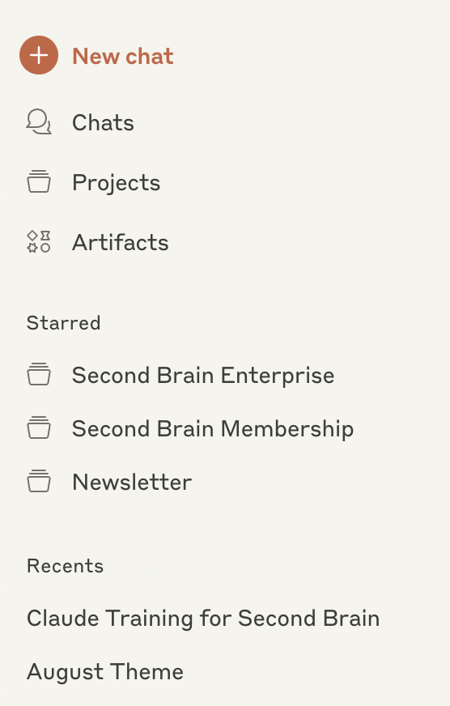
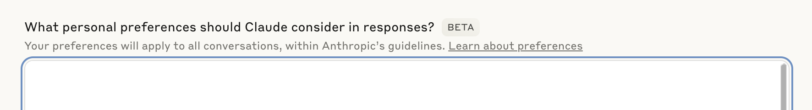
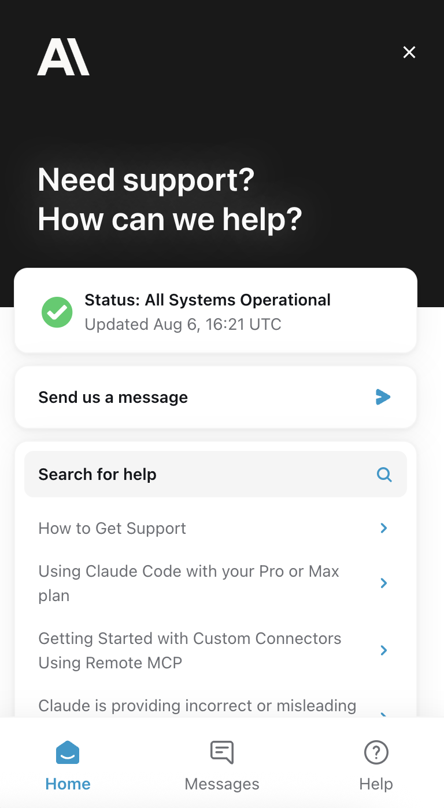

# Lesson 1: Understanding the Interface

> Beginner's Guide to Claude › Section 1: How to Use Claude › Lesson 1

[Open on Circle](https://community.empowerlabs.ai/c/beginner-s-guide-to-claude/sections/748240/lessons/2837850)

## Files

- [img01-Screenshot-2025-08-06-at-10.14.02.png](./assets/img01-Screenshot-2025-08-06-at-10.14.02.png) (68 KB)
- [img02-Screenshot-2025-08-06-at-15.27.00.png](./assets/img02-Screenshot-2025-08-06-at-15.27.00.png) (47 KB)
- [img03-Screenshot-2025-08-06-at-15.19.20.png](./assets/img03-Screenshot-2025-08-06-at-15.19.20.png) (187 KB)

## Content

---

## Claude Interface Overview

When you log into Claude, you'll see a clean interface designed to help you work efficiently. Here's what each section does:

_img01-Screenshot-2025-08-06-at-10.14.02.png_

**Chats**: This is where most of your work happens. Each chat is a conversation thread between you and Claude. You can have multiple chats running simultaneously, and each one maintains its own context and history. You’ll learn more about chats in [Lesson 3: Mastering Chats](https://community.empowerlabs.ai/c/beginner-s-guide-to-claude/sections/748240/lessons/2837854).

**Projects**: Projects are specialized workspaces available to Pro, Max, and Team users that bring together internal knowledge and chat activity in one place, with custom instructions to tailor Claude's responses. Projects maintain persistent context across multiple conversations, unlike regular chats that start fresh each time. You’ll learn more about projects in [Lesson 5: Organizing Your Work in Projects](https://community.empowerlabs.ai/c/beginner-s-guide-to-claude/sections/748240/lessons/2837860)

**Artifacts**: View all your creations in one organized location, browse Anthropic-created artifacts for inspiration, or create new artifacts from scratch. Claude creates an artifact when content is significant and self-contained, something you're likely to want to edit or iterate on, or represents complex content that stands on its own. You’ll learn more about artifacts in [Lesson 4: Working with Artifacts](https://community.empowerlabs.ai/c/beginner-s-guide-to-claude/sections/748240/lessons/2837858).

**Starred Section**: This shows your starred or favorited conversations and projects for quick access to your most important work.

**Recent Chats**: Your conversation history appears here, with the most recent chats at the top. This makes it easy to jump back into previous conversations or reference past work.

**Settings**: Located under a dropdown in the lower left-hand corner, this is where you can manage your account, billing, and preferences.

---

## Personal Preferences

Personal preferences are account-wide settings that help Claude understand your general preferences and communication style. **These preferences apply to every single chat you have with Claude** - whether inside a project or in standalone conversations.

To access your personal preferences, click the dropdown at the bottom left of your screen. Then select “Settings” and “Profile”.

_img02-Screenshot-2025-08-06-at-15.27.00.png_

---

## How to Get Help with Claude-Specific Questions

Click “Get Help” in the dropdown menu in the lower left-hand corner. This will allow you to chat with Anthropic directly.

_img03-Screenshot-2025-08-06-at-15.19.20.png_
