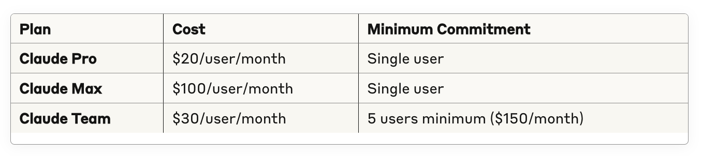
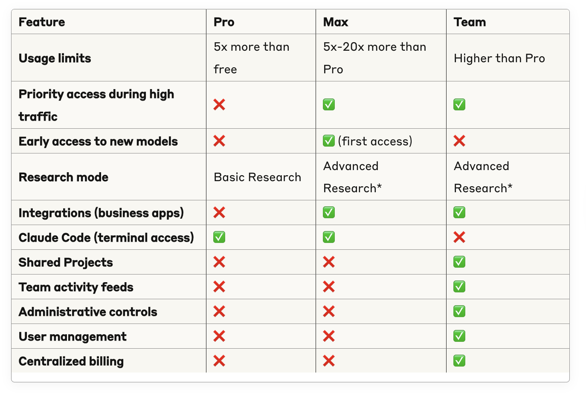

# Lesson 2: Choosing the Pro vs. Max vs. Team Plan

> Beginner's Guide to Claude › Section 1: How to Use Claude › Lesson 2

[Open on Circle](https://community.empowerlabs.ai/c/beginner-s-guide-to-claude/sections/748240/lessons/2837852)

## Files

- [img01-Screenshot-2025-08-06-at-11.15.41.png](./assets/img01-Screenshot-2025-08-06-at-11.15.41.png) (59 KB)
- [img02-Screenshot-2025-08-06-at-11.16.51.png](./assets/img02-Screenshot-2025-08-06-at-11.16.51.png) (189 KB)

## Content

## Pricing

_img01-Screenshot-2025-08-06-at-11.15.41.png_

Max has 2 tiers: $100 (5x usage) or $200 (20x usage). Annual billing offers discounts on Pro and Team plans.

As of Aug. 6, 2025. [Review the current pricing here. ](https://www.anthropic.com/pricing)

---

## Feature Comparison

### ✅ What's the Same (All Paid Plans Include)

- All Claude models
- 200K context window
- Projects (workspace organization)
- File uploads & analysis
- Extended thinking mode
- Basic web search
- Mobile & desktop apps

### 🔄 What's Different

_img02-Screenshot-2025-08-06-at-11.16.51.png_

*Advanced Research searches web + Google Workspace + integrations for up to 45 minutes

---

## Quick Decision Guide

### Choose **Claude Pro** if you:

- Work independently with moderate AI usage needs
- Need Claude Code for development work

### Choose **Claude Max** if you:

- Are a power user needing 5x-20x more usage than Pro
- Want priority access during high traffic times
- Use Advanced Research mode (web + Google Workspace + integrations)
- Want Claude Code access with higher usage limits

### Choose **Claude Team** if you:

- Have 5+ people who need AI access
- Want to share Projects and conversations
- Need administrative oversight and user management
- Collaborate frequently and benefit from shared context
- Plan to scale AI usage across your organization

---

## Bottom Line

**Same core AI models, different usage limits and features.** Pro offers solid individual use with Claude Code, Max provides premium individual capabilities (2 tiers: 5x or 20x usage) with priority access and early features, while Team enables organizational AI adoption with collaboration and management tools.

**Start with Pro** if you're unsure - you can always upgrade to Max or Team as your needs grow.
