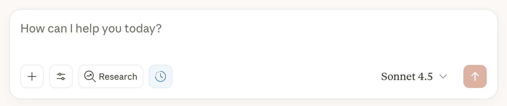
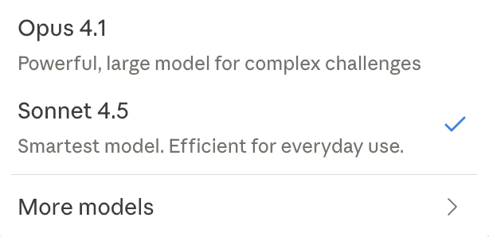
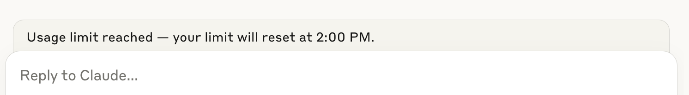

# Lesson 3: Mastering Chats

> Beginner's Guide to Claude › Section 1: How to Use Claude › Lesson 3

[Open on Circle](https://community.empowerlabs.ai/c/beginner-s-guide-to-claude/sections/748240/lessons/2837854)

## Files

- [img01-Screenshot-2025-09-30-at-15.23.44.png](./assets/img01-Screenshot-2025-09-30-at-15.23.44.png) (37 KB)
- [img02-Screenshot-2025-08-06-at-14.01.06.png](./assets/img02-Screenshot-2025-08-06-at-14.01.06.png) (31 KB)
- [img03-Screenshot-2025-09-30-at-15.22.46.png](./assets/img03-Screenshot-2025-09-30-at-15.22.46.png) (36 KB)
- [img04-Screenshot-2025-08-06-at-13.26.21.png](./assets/img04-Screenshot-2025-08-06-at-13.26.21.png) (32 KB)

## Content

---

## Chat Window Interface

When you start a new chat or open an existing conversation, you'll see several options at the bottom of the chat window that help you enhance your interaction with Claude:

_img01-Screenshot-2025-09-30-at-15.23.44.png_

**File Upload**: Click the + sign in the chat interface to upload files from your computer, add documents from Google Drive (if you have the integration enabled), or access other connected integrations and connectors. Claude [supports various document types](https://support.anthropic.com/en/articles/8241126-what-kinds-of-documents-can-i-upload-to-claude-ai), including PDFs, Word documents, Excel files, and images. Each file can be a maximum of 30MB. You can upload up to 20 files per chat.

**Tools**: This section contains various connectors and features to enhance Claude's capabilities:

- **Connectors/Integrations**: Available to paid plan users, these allow Claude to connect directly to your work tools and data. Available connectors include Notion (project management), Gmail and Google Calendar (email and scheduling), Google Drive (file storage), Zapier (workflow automation), Asana (project management), Intercom (customer support), Canva (design), Stripe (payments), and many others. You can browse and connect to these tools at [claude.ai/directory](https://claude.ai/directory) or through Settings > Connectors.
- **Web Search**: This allows Claude to search the internet for current information to supplement its responses.
- **Extended Thinking**: This feature allows Claude to work through complex problems step-by-step with deeper reasoning.
- **Styles**: Customize how Claude communicates with you by choosing from preset options (Normal, Concise, Explanatory, Formal) or creating custom styles based on your own writing samples or specific instructions.

**Research Button**: Available to users with paid Claude plans, Research transforms how Claude finds and analyzes information. When enabled, Claude operates agentically, conducting multiple searches that build on each other while determining exactly what to investigate next, delivering comprehensive answers with citations

**Model Selection**: Click on the model name to choose which version of Claude you'd like to chat with (see below for a model selection guide)

---

## Context Window

Claude’s **context window size is 200K**, meaning it can ingest 200K+ tokens (about 500 pages of text or more) when using a paid Claude plan. Once you reach ~200k tokens, the chat will end, and you will need to start a new chat.

_img02-Screenshot-2025-08-06-at-14.01.06.png_

---

## How Claude Remembers Context

Understanding how Claude's memory works is crucial for getting the best results:

**Within a Single Conversation:** Claude can see your entire conversation from the very first message to your current one. This includes all text exchanges, uploaded files, created artifacts, and any analysis performed. Think of it like Claude reading a complete transcript each time before responding.

**Between Conversations:** As of Aug. 13, Claude can search through your previous conversations inside AND outside of projects to find and reference relevant information in new chats. Outside of projects, you’ll have to proactively ask Claude to find what you discussed before, and it will pull together the appropriate context. [Read more about searching past chats here.](https://support.anthropic.com/en/articles/10185728-understanding-claude-s-personalization-features)

---

## Where to Start a New Chat (Inside or Outside of a Project)

**🚨 Important**: Once you start a chat outside of a project, it cannot be moved into a project later.

### Start a New Chat INSIDE Your Project When:

- You’re working on something related to the project topic
- Your team needs access to the conversation
- You need Claude to access the project knowledge
- Creating shared resources (templates, processes, SOPs)

### Start a New Chat OUTSIDE Your Project When:

- Asking quick one-off questions unrelated to your project
- Testing Claude's capabilities or experimenting
- Working on personal tasks
- The conversation won't need project context

---

## When to Start a New Chat vs. Continue an Existing One

**Continue in the same conversation when:**

- You're iterating on the same piece of work (refining a proposal, improving an analysis)
- You want to build on Claude's previous responses
- You're working through a multi-step process
- You need Claude to remember specific details from earlier in your session

**Start a new conversation when:**

- You're switching to a completely different topic or project
- You want a "fresh start" without any previous context influencing the response
- You’ve exceeded the context window of 200k tokens for a chat.

---

## Model Selection Guide

Anthropic offers different Claude models, each optimized for different needs. Understanding their strengths helps you select the best option for your specific tasks.

_img03-Screenshot-2025-09-30-at-15.22.46.png_

### **Quick Decision Flow**

- **Is the task coding-heavy, complex, or multi-step? **→ Choose **Opus 4.1**, *if* it’s available and within your weekly limit.
- **Is this daily business writing, light analysis, or summarization? **→ Use **Sonnet 4.5**, as it offers more time allocation and faster turnaround.
- **If uncertain**: Start in **Sonnet 4.5**. If the output depth or reasoning scope feels too narrow—and Opus quota allows—switch to **Opus 4.1**.

---

## **Chat Usage Limits**

Even on Pro or Team plans, usage isn’t unlimited. Anthropic uses **session-based** and **weekly quotas**, including model-specific limits:

_img04-Screenshot-2025-08-06-at-13.26.21.png_

- **Session limits** reset every 5 hours. Most users get about **45 messages per session** with Sonnet 4.5 under normal conditions.
- **[Weekly rate limits](https://techcrunch.com/2025/07/28/anthropic-unveils-new-rate-limits-to-curb-claude-code-power-users/?utm_source=chatgpt.com)** take effect August 28, 2025:
  - **Pro Plan** users typically have access to **40–80 hours of Sonnet 4.5** per week.
  - **Max Plan or Team Plan (5× usage tier)** offers **140–280 hours of Sonnet 4.5** per week, and **15–35 hours of Opus 4.1**.
  - **Max 20× plans (~$200/month)** extend that to roughly **240–480 hours Sonnet 4.5** and **24–40 hours Opus 4.1** weekly.

In practice, users on Pro often hit Opus 4.1 limits quickly (sometimes after just a few queries), and Opus draws from only ~20% of overall allocation.

Support docs confirm usage caps remain dynamic and depend on message length, attached files, conversation length, and model used.
