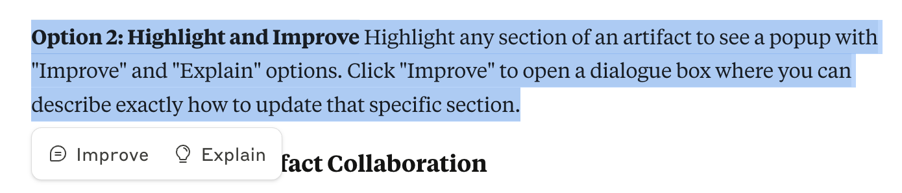
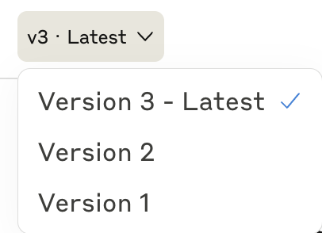
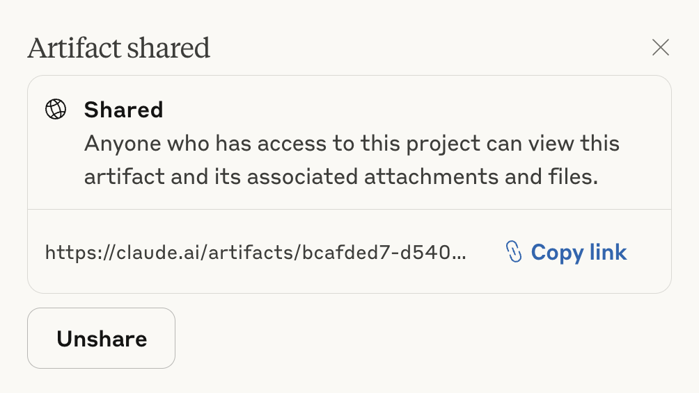
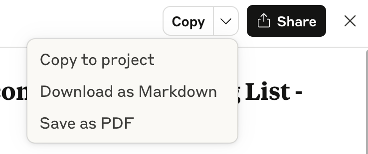
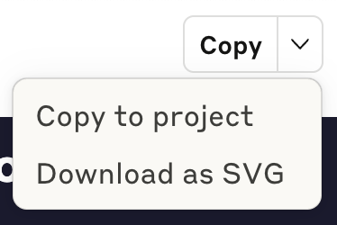
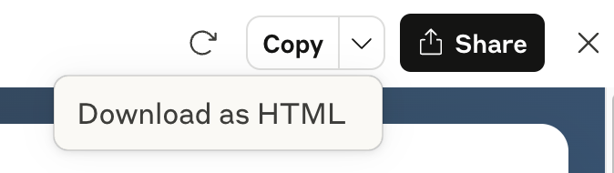
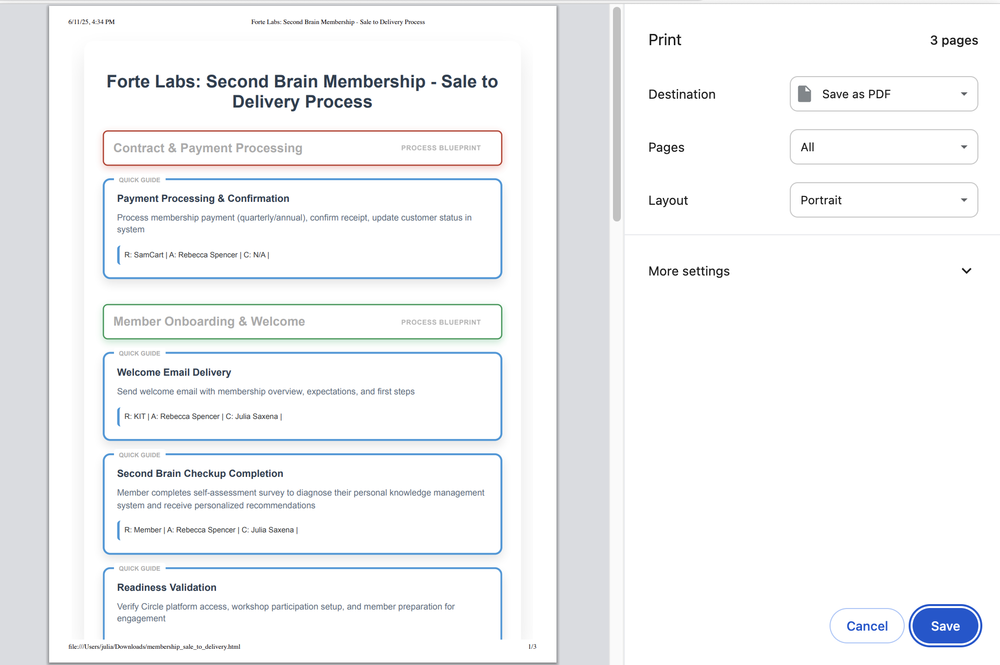

# Lesson 4: Working with Artifacts

> Beginner's Guide to Claude › Section 1: How to Use Claude › Lesson 4

[Open on Circle](https://community.empowerlabs.ai/c/beginner-s-guide-to-claude/sections/748240/lessons/2837858)

## Files

- [img01-Screenshot-2025-08-06-at-14.08.34.png](./assets/img01-Screenshot-2025-08-06-at-14.08.34.png) (89 KB)
- [img02-Screenshot-2025-08-06-at-14.12.13.png](./assets/img02-Screenshot-2025-08-06-at-14.12.13.png) (24 KB)
- [img03-Screenshot-2025-08-06-at-14.15.51.png](./assets/img03-Screenshot-2025-08-06-at-14.15.51.png) (72 KB)
- [img04-Screenshot-2025-06-11-at-16.30.45.png](./assets/img04-Screenshot-2025-06-11-at-16.30.45.png) (44 KB)
- [img05-Screenshot-2025-08-10-at-17.40.01.png](./assets/img05-Screenshot-2025-08-10-at-17.40.01.png) (25 KB)
- [img06-Screenshot-2025-06-11-at-16.32.48.png](./assets/img06-Screenshot-2025-06-11-at-16.32.48.png) (32 KB)
- [img07-Screenshot-2025-06-11-at-16.35.11.png](./assets/img07-Screenshot-2025-06-11-at-16.35.11.png) (358 KB)

## Content

---

## What Are Artifacts?

Artifacts are Claude's way of creating substantial, reusable content that you can reference, edit, and build upon throughout your conversation.

Think of artifacts as *living documents* that sit alongside your chat. Instead of Claude just telling you about something, it creates a working version you can actually use.

---

## When Does Claude Create Artifacts?

Claude automatically creates artifacts when you ask for:

- **Documents longer than 20 lines** (reports, SOPs, templates)
- **Any code** (scripts, HTML pages, data analysis)
- **Structured content** (meal plans, project timelines, checklists)
- **Creative writing** (emails, presentations, marketing copy)
- **Data visualizations** (charts, graphs, dashboards)

You don't need to ask Claude to "make this an artifact." It happens automatically when the content meets these criteria.

---

## How to Make Changes to an Artifact

You have two ways to modify artifacts:

**Option 1: Direct Instructions:** Simply tell Claude in the chat what you want changed.

- "Add a section about budget considerations"
- "Make the chart colors blue and green"
- "Change the deadline to next Friday"

**Option 2: Highlight and Improve:** Highlight any section of an artifact to see a popup with "Improve" and "Explain" options. Click "Improve" to open a dialogue box where you can describe exactly how to update that specific section.

_img01-Screenshot-2025-08-06-at-14.08.34.png_

### 🚨 What to do when an artifact doesn’t update

Sometimes, Claude will claim it has updated an artifact while you are not seeing any changes. In this case, point out this error to Claude and ask it to fix it.

---

## Artifact Versions

Claude automatically tracks versions as you make changes to artifacts. Each time you request a modification, a new version is created while preserving the previous ones. The latest version is always highlighted and shown by default.

_img02-Screenshot-2025-08-06-at-14.12.13.png_

**Why this matters**:

- **Safety net**: Easy to revert if changes don't work as expected
- **Comparison**: Review how your document or tool evolved
- **Recovery**: Access earlier versions if you want to branch in a different direction

---

## Sharing Artifacts

You can easily share any artifact with team members or stakeholders:

- Look for the share button in the top right corner of any artifact
- Click it to generate a shareable link
- Send the link to anyone who needs access

_img03-Screenshot-2025-08-06-at-14.15.51.png_

**Note**: Shared artifacts are view-only for recipients. If they need to make changes, they'll need their own Claude conversation.

---

## How to Save or Download Artifacts

### Text Artifacts

In the upper right-hand corner, you have the following options for text-based artifacts:

- **Copy**: Copies the text in markdown format (e.g., preserving formatting such as headings, bold, italics, etc.), which allows you to paste it anywhere (e.g., a Google Doc or your notetaking app).
- **Copy to project:** Adds the artifact to your project knowledge (only available if the chat you’re in is part of a project).
- **Download as Markdown: **Downloads a markdown file (.md) that you can import into other software, such as your notetaking app.
- **Save as PDF**: Opens the print dialogue and allows you to save the artifact in PDF format to your computer.

_img04-Screenshot-2025-06-11-at-16.30.45.png_

---

### Image Artifacts

When it comes to images and graphics, Claude may output them in one of two ways:

### 1. SVG

_img05-Screenshot-2025-08-10-at-17.40.01.png_

- **Copy**: Copies the underlying XML markup (which defines the graphical elements) to your clipboard.
- **Copy to project:** Adds the artifact to your project knowledge (only available if the chat you’re in is part of a project).
- **Download as SVG**: Downloads your graphic as a .svg file, which is a common format for graphics that allows for resizing without any loss of quality.

### 2. HTML

_img06-Screenshot-2025-06-11-at-16.32.48.png_

- Save the HTML file to your download folder
- Open the HTML file in a browser (e.g., Chrome, Firefox, Edge)
- Use the browser’s print feature (Ctrl+P or Cmd+P).
- In the print dialog, select "Save as PDF" or "Print to PDF" as the printer destination.
- Adjust settings like layout and pages if needed, then save the PDF to your desired location.

_img07-Screenshot-2025-06-11-at-16.35.11.png_
