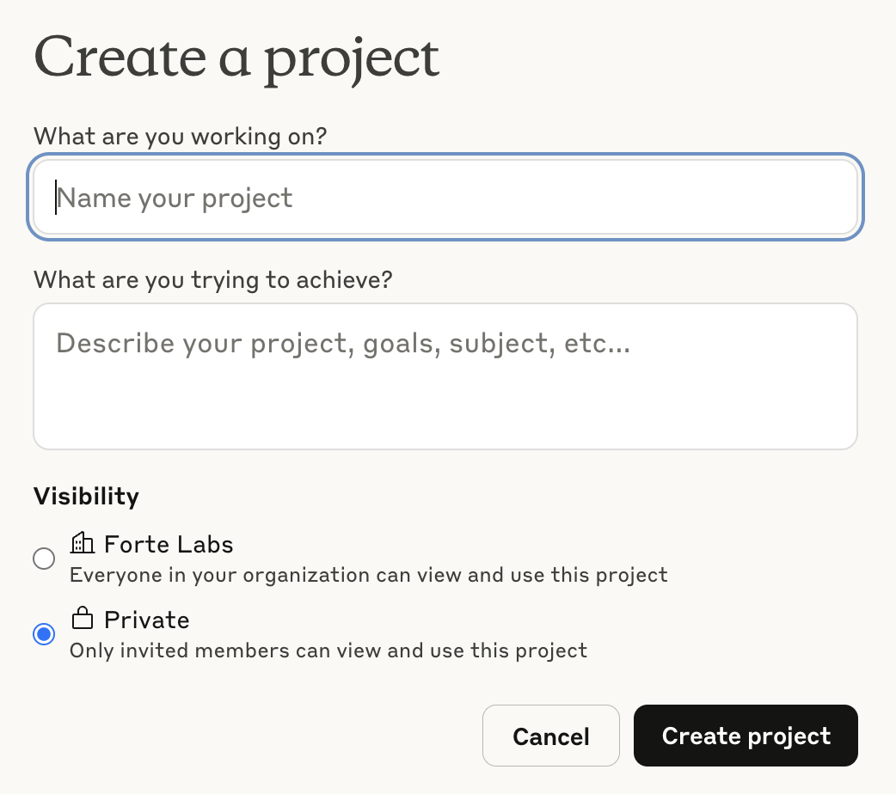
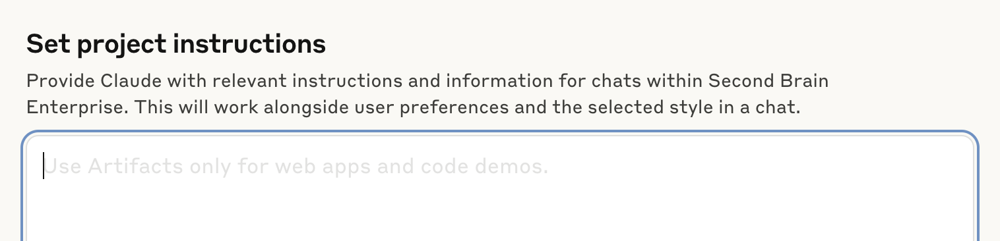
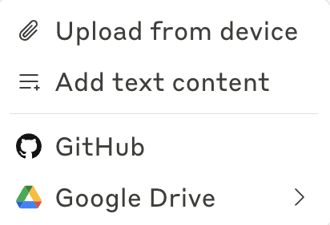
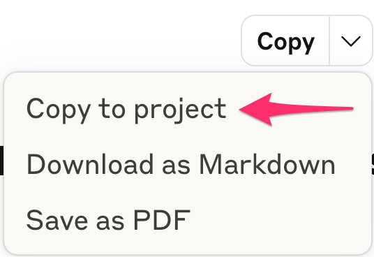
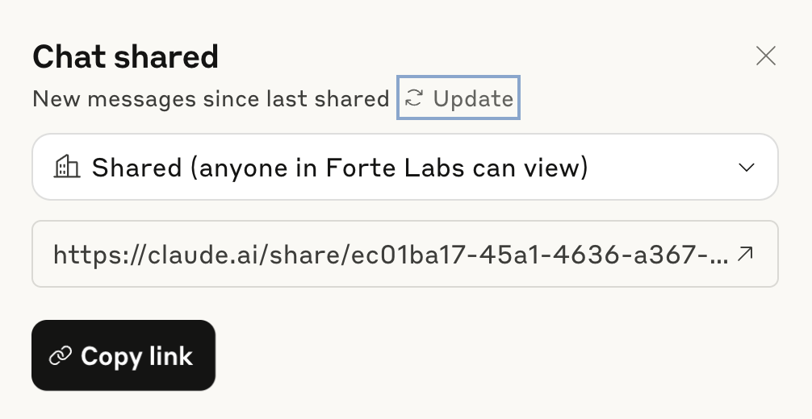

# Lesson 5: Organizing Your Work in Projects

> Beginner's Guide to Claude › Section 1: How to Use Claude › Lesson 5

[Open on Circle](https://community.empowerlabs.ai/c/beginner-s-guide-to-claude/sections/748240/lessons/2837860)

## Files

- [img01-Screenshot-2025-08-06-at-14.38.26.png](./assets/img01-Screenshot-2025-08-06-at-14.38.26.png) (117 KB)
- [img02-Screenshot-2025-08-06-at-14.45.39.png](./assets/img02-Screenshot-2025-08-06-at-14.45.39.png) (67 KB)
- [img03-Screenshot-2025-08-06-at-14.48.20.png](./assets/img03-Screenshot-2025-08-06-at-14.48.20.png) (27 KB)
- [img04-Screenshot_2025-06-10_at_8_01_56_AM.png](./assets/img04-Screenshot_2025-06-10_at_8_01_56_AM.png) (33 KB)
- [img05-Screenshot-2025-08-06-at-14.53.05.png](./assets/img05-Screenshot-2025-08-06-at-14.53.05.png) (66 KB)

## Content

---

## What Are Projects

Projects are self-contained workspaces that bring together your documents, custom instructions, and chat history in one organized place. Each project includes a 200K context window (equivalent to a 500-page book) so you can upload substantial amounts of relevant content.

---

## **Why Use Projects?**

- **Persistent context**: Claude remembers your project knowledge across all conversations
- **Custom instructions**: Tailor Claude's responses for specific roles or tasks
- **Collaboration**: Share projects with team members (Team plan)
- **Organization**: Keep related work together and build on previous insights

---

## Setting Up Your First Project

### 1. Create the Project

- Click on “Projects” and select "New Project"
- Give it a descriptive name and brief description

### 2. Choose Visibility

**Private**: Only you and invited members can access

- Best for: Personal work, sensitive information, draft projects

**Share with organization**: Everyone in your company can view and use *(only available on Team and Enterprise plans)*

- Best for: Company-wide resources, shared templates, team collaboration

_img01-Screenshot-2025-08-06-at-14.38.26.png_

---

## Set Custom Project Instructions

Project instructions tell Claude how to behave within your project. Think of them as your project's "personality" and working style.

**Examples of effective custom instructions**:

- "Act as a senior business strategist focused on B2B SaaS companies"
- "Use our company's writing style: conversational, direct, and action-oriented"
- "When analyzing data, always provide three specific recommendations"
- "Reference our Master Prompt context when making business decisions"

**Best practice**: Be specific about tone, role, and output format you want Claude to maintain throughout the project.

_img02-Screenshot-2025-08-06-at-14.45.39.png_

---

## Adding to Project Knowledge

There are two ways to add knowledge to your projects:

### 1. Click "+" in the Project Knowledge section to upload documents or add text content

You can also add content from connected apps such as Google Drive.

**🚨 The Google Drive connection is only available in private projects!**

_img03-Screenshot-2025-08-06-at-14.48.20.png_

### 2. Copy Artifacts to the Project

If you come across an artifact that you want Claude to take into consideration going forward, click the downward-facing arrow at the top-right of the artifact and select “Copy to project.”

This instantly saves that artifact to this project’s “knowledge,” which means the AI will draw on it for all future conversations.

_img04-Screenshot_2025-06-10_at_8_01_56_AM.png_

---

## **Sharing Chats Within Projects**

Chats are private by default, even within shared Projects. To share a specific chat or message, click the arrow in the upper right corner of the chat, then select "Share & Copy Link" to generate a shareable link.

_img05-Screenshot-2025-08-06-at-14.53.05.png_

**🚨 Chats that use an integration (e.g., Google Drive) can’t be shared!**

**Update Shared Chats:** If you want to include new messages in a previously shared chat snapshot, use the "Update snapshot" option in the Share menu to keep the shared content current.

**Unshare Chats:** To revoke access, change the chat’s visibility from "Shared" to "Private" in the Share menu, disabling the direct link.

For more about project visibility and sharing, refer to [Anthropic’s official guide](https://support.anthropic.com/en/articles/9519189-project-visibility-and-sharing).
