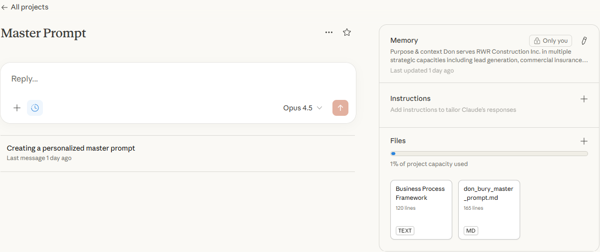
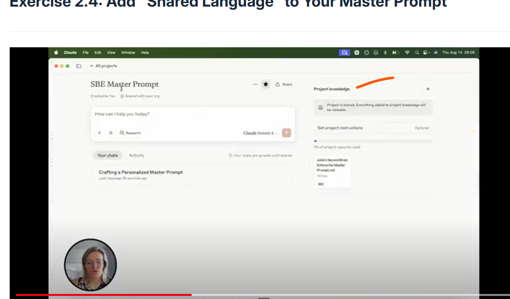

# Claude interface difference between team and single user.

> Discussion › Post 22 › by Don Bury › 2026-01-30

[Open on Circle](https://community.empowerlabs.ai/c/discussion-b92449/claude-interface-difference-between-team-and-single-user)

## Files

- [img01-image.png](./assets/img01-image.png) (58 KB)
- [img02-image.png](./assets/img02-image.png) (161 KB)

## Content

My single user claude account doesn’t have project knowledge option.  I pasted the business process framework into files.  Is that good, or should I paste it into instructions?

Screen shot from Claude $20/month single user

_img01-image.png_

training video screen shot

_img02-image.png_

## Discussion (1 comment)

- **Josh Cordes** · 2026-01-30
  Files is the project knowledge. Claude just has updated its UX from the video and you’re doing it correctly.
