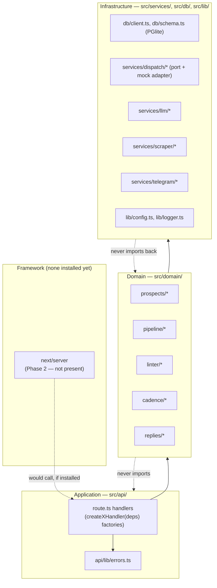
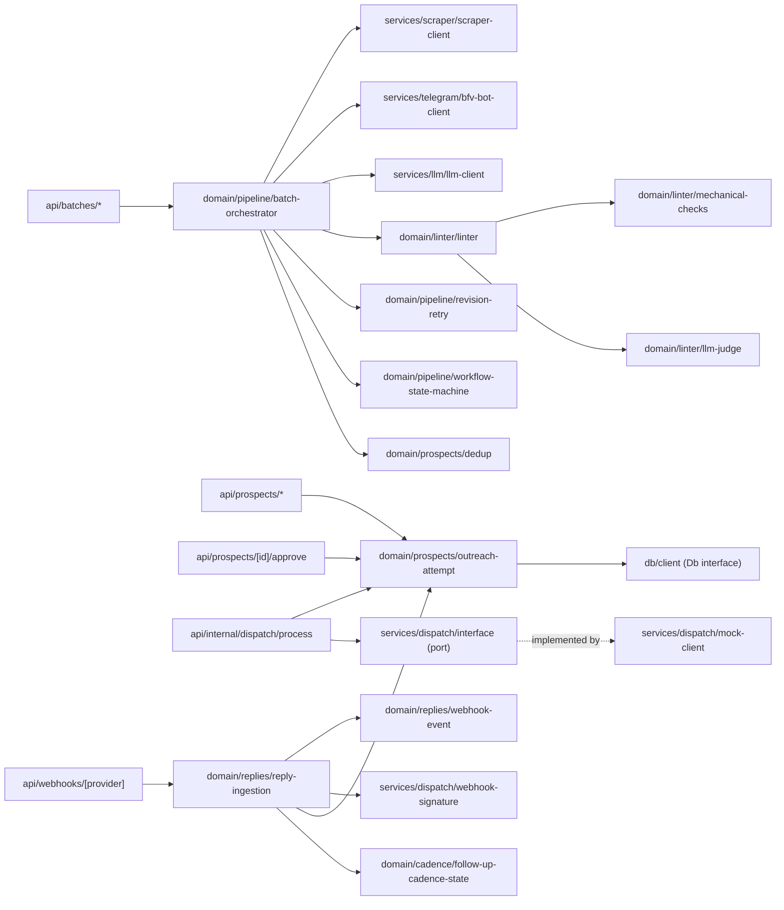
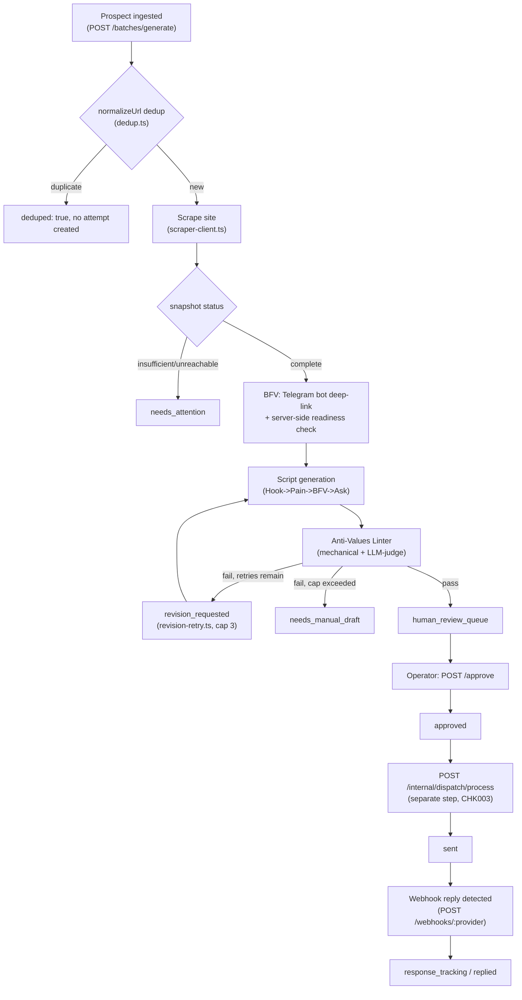
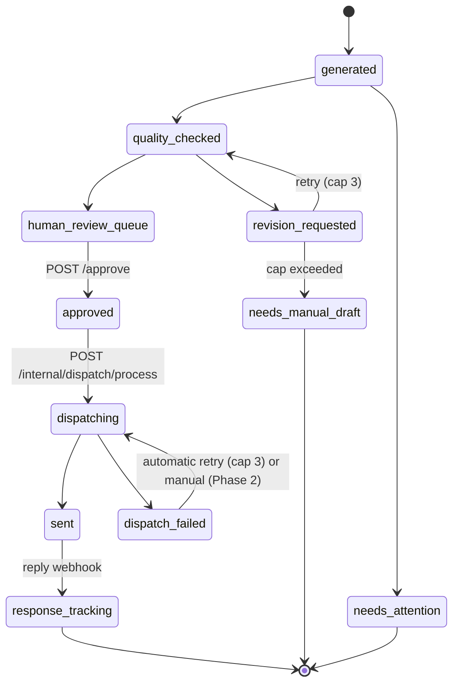
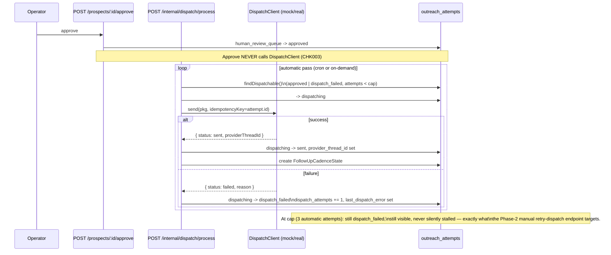

# outreach-engine Architecture

Rule of 100 Outreach Engine — MVP Phase 1. Isolated package
(`outreach-engine/`, own `package.json`, own `node_modules`), zero shared
build with the root AITransforms site.

## 1. Layer Diagram

Clean Architecture: dependencies point inward only. `domain/` and
`services/`+`db/` (infrastructure, behind ports) never import from `api/`,
never see `Request`/`Response`, never see a Next.js type — verified: zero
`next` import anywhere in `src/`, `next` isn't even a `package.json`
dependency yet (deferred to Phase 2).

## 2. Dependency Diagram (module-level)

## 3. Outreach Pipeline Diagram

Prospect → Research → BFV → Script → Quality → Approval → Dispatch →
Tracking, as coordinated by `batch-orchestrator.ts`:

## 4. State Machine

Source of truth: `domain/pipeline/workflow-state-machine.ts`
(`LEGAL_TRANSITIONS`). `sent` is reachable **only** through `dispatching`
— never directly from `approved` — enforced structurally, not by
convention (`canReachSentDirectlyFromApproved()` returns `false`, tested).

`TERMINAL_TO_BATCH_RESUME` (everything except `generated`) marks which
states a batch-resume-on-retry must never touch — Phase 2/Future
(resume logic itself isn't built in MVP-1).

## 5. Dispatch Retry Flow

CHK003 guarantee: a dispatch failure is never a dead end. Automatic path
is MVP-1 (`T047`); manual `/retry-dispatch` is Phase 2 (`T048`).

## 6. Module Responsibilities

| Module | Layer | Responsibility |
|---|---|---|
| `api/batches/generate`, `api/batches/[date]` | Application | Batch creation/read HTTP boundary |
| `api/prospects/route.ts`, `api/prospects/[id]/route.ts` | Application | Prospect list/detail HTTP boundary |
| `api/prospects/[id]/approve` | Application | Tier-3 approval gate — human_review_queue → approved, **nothing else** |
| `api/internal/dispatch/process` | Application | Automatic dispatch sweep, service-credential-only |
| `api/webhooks/[provider]` | Application | Inbound reply-webhook HTTP boundary, fail-closed signature check |
| `api/lib/errors.ts` | Application | Shared JSON response/error shape |
| `domain/prospects/prospect.ts` | Domain | Prospect entity + repository |
| `domain/prospects/outreach-attempt.ts` | Domain | OutreachAttempt entity, workflow_state persistence, dispatch bookkeeping |
| `domain/prospects/dedup.ts` | Domain | URL normalization (minimal, MVP-1 scope) |
| `domain/pipeline/batch-orchestrator.ts` | Domain | Coordinates scrape→BFV→script→lint per attempt |
| `domain/pipeline/workflow-state-machine.ts` | Domain | Legal state transition table, the CHK003 structural proof |
| `domain/pipeline/revision-retry.ts` | Domain | Bounded lint-fail regeneration loop (cap 3) |
| `domain/pipeline/bfv-deliverable.ts` | Domain | BFV entity, tri-state verification status |
| `domain/pipeline/outreach-script.ts` | Domain | Script generation entity/logic |
| `domain/pipeline/scraped-site-snapshot.ts` | Domain | Scrape result entity |
| `domain/linter/*` | Domain | Anti-Values Linter — mechanical checks, LLM-judge, combined verdict |
| `domain/cadence/follow-up-cadence-state.ts` | Domain | Cadence record creation (US3 read/advance logic is Future) |
| `domain/replies/webhook-event.ts` | Domain | WebhookEvent entity, `(provider, provider_event_id)` idempotency |
| `domain/replies/reply-ingestion.ts` | Domain | Verify → dedup → match → outcome-regression guard → apply |
| `db/schema.ts`, `db/client.ts` | Infrastructure | PGlite schema + connection, owned exclusively by `api/`+`domain/` |
| `services/dispatch/interface.ts` | Infrastructure (port) | `DispatchClient` contract |
| `services/dispatch/mock-client.ts` | Infrastructure (adapter) | Test double; real Instantly/Unipile adapters are Phase 2 |
| `services/dispatch/webhook-signature.ts` | Infrastructure | HMAC signature verification, fail-closed |
| `services/llm/llm-client.ts` | Infrastructure | LLM call wrapper |
| `services/llm/untrusted-content.ts` | Infrastructure | Prompt-injection sanitization boundary |
| `services/scraper/scraper-client.ts` | Infrastructure | Site fetch + classification |
| `services/telegram/bfv-bot-client.ts` | Infrastructure | Telegram bot deep-link + readiness check |
| `lib/config.ts` | Infrastructure | Env/secrets loader, never logged |
| `lib/logger.ts` | Infrastructure | Structured JSON stdout logging |

## 7. Rules Contributors Must Follow

1. **Dependency Rule is one-way.** `domain/` and `services/`/`db/` MUST
   NEVER import from `api/`. `domain/` MUST NEVER reference `Request`,
   `Response`, or any Next.js type. If a domain function seems to need
   HTTP context, pass plain data instead — that's an `api/` translation
   job.
2. **Route handlers stay factories.** `export function createXHandler(db,
   ...deps)` returning the actual `POST`/`GET`, never a bare top-level
   `export async function POST()` that reaches a module-level singleton.
   This is what gives tests per-test DB/mock isolation without a running
   server — see `docs/ARCHITECTURE.md` §1 and the dependency-injection
   rationale already established for the existing handlers.
3. **New external integrations go behind a port.** Add the interface to
   `services/<name>/interface.ts` first, mock adapter second, real
   adapter last — the pattern `services/dispatch/` already follows
   (`interface.ts` → `mock-client.ts` → future `instantly-client.ts`).
4. **State transitions only through `workflow-state-machine.ts` /
   `outreach-attempt.transition()`.** Never `setWorkflowState()` directly
   from `api/` or ad hoc SQL — `transition(db, id, from, to)` is the sole
   enforcement point for illegal transitions (the 409 contract). Adding a
   new state requires updating `LEGAL_TRANSITIONS`, `ALL_WORKFLOW_STATES`,
   and the DB `CHECK` constraint in `schema.ts` together.
5. **Approval and dispatch remain structurally separate (CHK003).** No
   code path may call a `DispatchClient` from the approve handler, and no
   code path may reach `sent` except via `dispatching`. Any new send
   trigger must go through the dispatch sub-machine, not bypass it.
6. **Dispatch failures must stay recoverable.** Any new failure path on
   `dispatching` must land on a state that's still visible and still
   retriable (`dispatch_failed`, not silent loss) — never revoke or
   redo `approved`.
7. **Webhook/external-input handlers stay fail-closed.** Signature
   verification (or equivalent trust boundary) happens before any state
   read/write, not after. Missing/invalid credential ⇒ reject, no partial
   processing.
8. **Untrusted scraped/external text goes through the sanitizer before
   any LLM prompt.** Every call site assembling a prompt from scraped
   content must route it through `services/llm/untrusted-content.ts`
   first — no new direct-to-prompt path.
9. **No framework dependency in `domain/`, ever — even after `next` is
   installed in Phase 2.** Installing Next.js for real route serving must
   not change any `domain/` or `services/` import graph; only `api/`
   route files may start importing `next/server` types.
10. **Match the MVP/Phase categorization already in
    `specs/001-rule-of-100-outreach/tasks.md`.** Don't silently implement
    Phase 2/Future scope inside an MVP-1 module (candidate-pool union,
    batch-resume, cadence advancement, dashboard reads, real provider
    clients) — land it as its own task, categorized, tested, and called
    out, the way T028 was explicitly flagged as an intentional
    over-scope inclusion rather than folded in unannounced.
